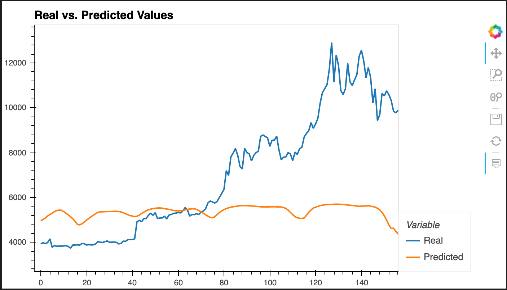
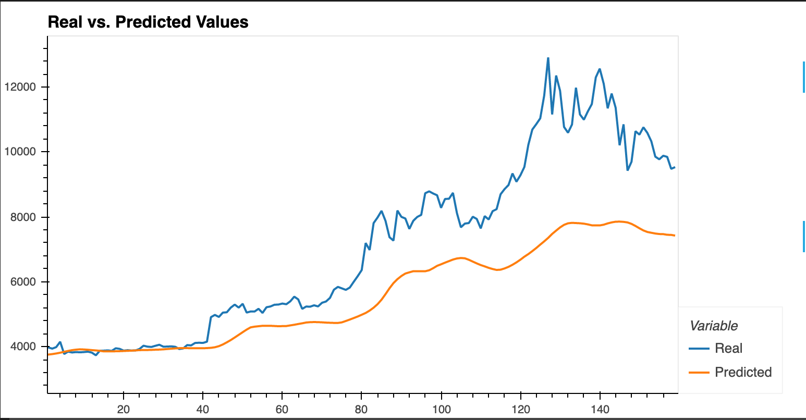

# LSTM Stock Predictor


*This repository contains the Unit 14 Deep Learning homework assignment, LSTM Stock Predictor in the FinTech bootcamp course at the University of Toronto's School of Continuing Studies.*

---

## Table of Contents

- [Project Description](#Project-Objectives)
- [Installation Requirements](#Installation-Requirements)
- [File Contents](#File-Contents)

---

## Project Objectives 

The following report uses deep learning recurrent neural networks to model Bitcoin closing prices. The objective is to use two models; Fear and Greed indicators and a window of closing prices to predict the following days closing stock price.  

### Part 1: Fear & Greed Model 

Part 1 of the Unit 14 homework assignment uses FNG values to try and predict the following days closing price. The model uses 70% of the data for training and the remaining 30% as testing data. Additionally, a MinMaxScaler is applied to the features (X) and target (y) to scale the data for the model. 



### Part 2: Window Closing Prices Model 

The second part of this assignment uses the historical closing prices in an attempt to predict the following days closing price. To withhold a better degree of accuracy, the model uses the same parameters for training and testining as well as LSTM RNN architecture as the first model. 



---

## Installation Requirements

To successfully view parts 1 and 2 of the assignment deliverables; [FNG LSTM Stock Predictor Notebook](FNG_LSTM_Stock_Predictor.ipynb) and [Closing Prices LSTM Stock Predictor Notebook](Closing_LSTM_Stock_Predictor.ipynb), the following installations are required: 

```
pip install pandas
pip instal numpy
pip install matplotlib
pip install hvplot
```

---

## File Contents

- [FNG LSTM Stock Predictor Notebook](FNG_LSTM_Stock_Predictor.ipynb)
- [Closing Prices LSTM Stock Predictor Notebook](Closing_LSTM_Stock_Predictor.ipynb)
- [Summary of Findings](summary_of_findings.md)
- [Unit 14 Instructions](unit_14_instructions.md)

---