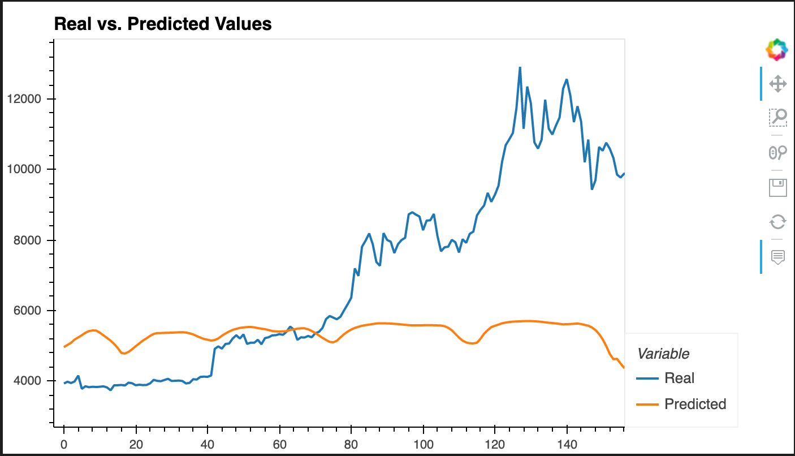

# LSTM Stock Predictor Summary of Findings

 

*The following document reports a summary of the analysis and findings conducted in the LSTM Stock Predictor Deep Learning assignment.*

---

## Sections 

- [LSTM Stock Predictor: Fear & Greed Index](#Fear-&-Greed-Index-Performance)
- [LSTM Stock Predictor: Closing Prices](#Closing-Price-Model-Performance)
- [Final Conclusions](#Final-Conclusions)

---

## Fear & Greed Index Performance 

The overall FNG model performance has a greater difficulty following the actual Bitcoin value given the ten day window. Therefore, the models' accuracy in predicting the eleventh day closing price for Bitcoin may not be as optimal as another model. 

 

### Model Loss & Window Size 

- FNG Window Size: 10 Day 
- FNG Model Loss: 0.1055

---

## Closing Price Model Performance 

Based on the "Real Vs. Predicted Values" line chart, it is evident the closing prices model has an improved accuracy in following the actual values of Bitcoin compared to the FNG model. Therefore, the model has an increased chance in predicting the eleventh day closing price of Bitcoin.

### Model Loss & Window Size 

- Closing Price Window Size: 10 Day 
- Closing Price Model Loss: 0.0428

---

## Final Conclusions 

Based on the trained and tested models, it appears the Closing Prices model performs better in terms of following the stocks actual value. Additionally, the Closing Prices model had a better performance in terms of model loss. The Fear and Greed Index model loss is 0.1055 verses the Closing Prices model loss which is slightly lower at, 0.0428. 

---

